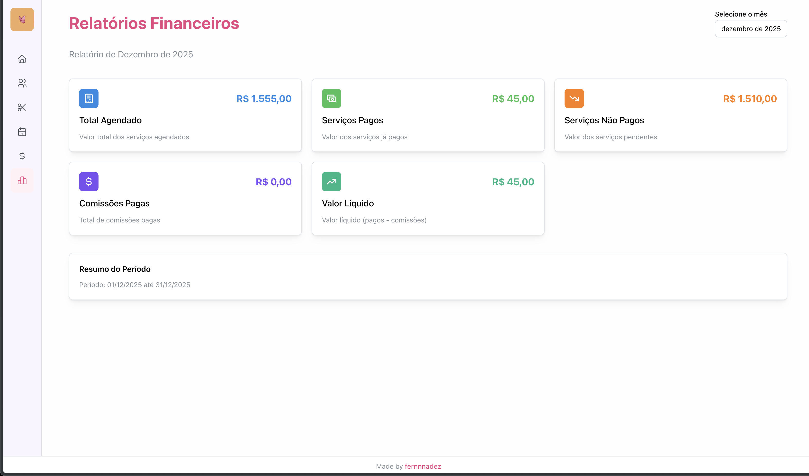
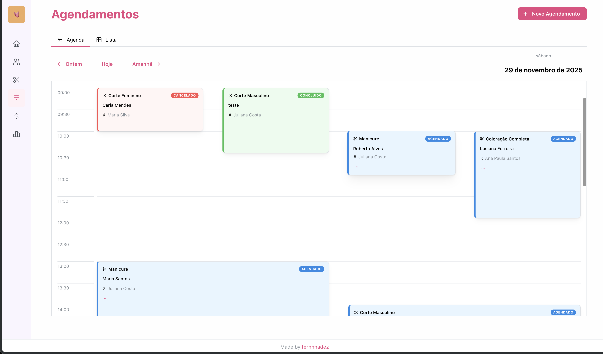
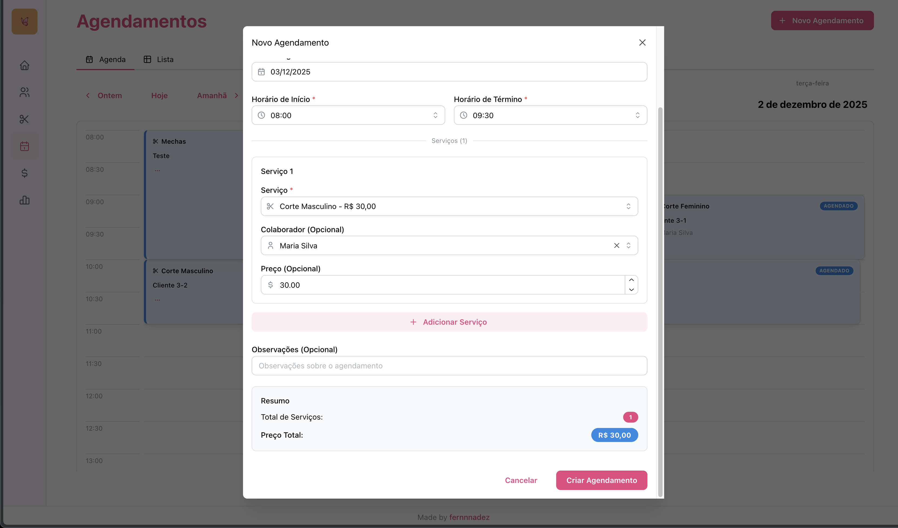

# 💅 Beauty Express

Sistema completo de gestão para salões de beleza, desenvolvido com foco em agendamentos, controle de colaboradores, serviços e cálculo automático de comissões.

## 📋 Sobre o Projeto

O **Beauty Express** é uma solução completa para gerenciamento de salões de beleza, oferecendo funcionalidades essenciais para o dia a dia do negócio:

- **Gestão de Colaboradores**: Cadastro e controle de profissionais com percentuais de comissão personalizados
- **Catálogo de Serviços**: Gerenciamento completo de serviços oferecidos com preços configuráveis
- **Sistema de Agendamentos**: Criação, edição e controle de agendamentos com múltiplos serviços
- **Cálculo Automático de Comissões**: Sistema inteligente que calcula comissões baseado nos serviços realizados
- **Relatórios Financeiros**: Visualização de relatórios mensais com totais de receita, comissões e valores líquidos

## 📸 Screenshots e Vídeos

### Screenshots

#### Dashboard


#### Agendamentos


#### Criando um Agendamento


<!-- ### Vídeos -->

<!-- Adicione aqui links para vídeos demonstrativos quando disponíveis -->
<!-- 
- [Demonstração Completa do Sistema](https://youtube.com/...)
- [Tutorial de Uso](https://youtube.com/...)
- [Apresentação das Funcionalidades](https://youtube.com/...)
-->


## 🏗️ Arquitetura

O projeto segue uma arquitetura em camadas (Layered Architecture) com separação clara de responsabilidades:

### Backend (API)

```
/api/src
├── application/          # Camada de Aplicação
│   ├── controllers/      # Controllers REST (endpoints HTTP)
│   ├── dtos/            # Data Transfer Objects (validação e transformação)
│   └── interceptors/    # Interceptors (transformação de dados)
│
├── domain/              # Camada de Domínio
│   ├── entities/        # Entidades do domínio (TypeORM)
│   ├── repositories/   # Repositórios (abstração de acesso a dados)
│   ├── services/        # Serviços de domínio (regras de negócio)
│   └── modules/         # Módulos NestJS por contexto
│
├── config/              # Configurações
│   └── database.config.ts
│
└── utils/               # Utilitários
    └── date.util.ts     # Funções auxiliares para manipulação de datas
```

**Princípios da Arquitetura:**
- **Separação de Responsabilidades**: Cada camada tem uma responsabilidade específica
- **Inversão de Dependências**: Dependências apontam para abstrações
- **Domain-Driven Design**: Foco nas regras de negócio no domínio
- **Repository Pattern**: Abstração da camada de persistência

### Frontend

```
/frontend/src
├── components/          # Componentes React reutilizáveis
│   ├── appointment/    # Componentes de agendamento
│   ├── collaborator/   # Componentes de colaborador
│   ├── service/        # Componentes de serviço
│   └── Layout.tsx      # Layout principal
│
├── pages/              # Páginas da aplicação
│   ├── Dashboard.tsx
│   ├── Collaborators.tsx
│   ├── Services.tsx
│   ├── Appointments.tsx
│   ├── Commissions.tsx
│   └── FinancialReports.tsx
│
├── hooks/              # Custom Hooks (React Query)
│   ├── useCollaborators.ts
│   ├── useServices.ts
│   ├── useAppointments.ts
│   └── useCommissions.ts
│
├── services/           # Services de comunicação com API
│   ├── collaborator.service.ts
│   ├── service.service.ts
│   ├── appointment.service.ts
│   └── commission.service.ts
│
└── types/              # Definições TypeScript
    └── index.ts
```

## 🚀 Tecnologias

### Backend
- **NestJS** - Framework Node.js para aplicações escaláveis
- **TypeORM** - ORM para TypeScript/JavaScript
- **SQLite** - Banco de dados (pode ser facilmente migrado para PostgreSQL/MySQL)
- **TypeScript** - Tipagem estática
- **Jest** - Framework de testes
- **Swagger** - Documentação automática da API

### Frontend
- **React 19** - Biblioteca para construção de interfaces
- **Vite** - Build tool e dev server
- **Mantine** - Biblioteca de componentes UI moderna
- **React Query** - Gerenciamento de estado do servidor
- **React Router** - Roteamento
- **Axios** - Cliente HTTP
- **TypeScript** - Tipagem estática
- **Luxon** - Manipulação de datas

## 📦 Funcionalidades

### 👥 Gestão de Colaboradores
- ✅ Cadastro completo de colaboradores
- ✅ Definição de percentual de comissão por colaborador
- ✅ Ativação/desativação de colaboradores
- ✅ Busca e filtros
- ✅ Associação de colaboradores a serviços específicos

### ✂️ Catálogo de Serviços
- ✅ Cadastro de serviços com preços padrão
- ✅ Descrição detalhada dos serviços
- ✅ Edição e exclusão de serviços
- ✅ Busca por nome
- ✅ Associação de serviços a colaboradores

### 📅 Sistema de Agendamentos
- ✅ Criação de agendamentos com múltiplos serviços
- ✅ Definição de data, horário de início e fim
- ✅ Atribuição de colaboradores aos serviços agendados
- ✅ Preços customizados por agendamento
- ✅ Observações e notas
- ✅ Status: Agendado, Concluído, Cancelado
- ✅ Conclusão e cancelamento de agendamentos
- ✅ Filtro por data
- ✅ Cálculo automático do preço total

### 💰 Sistema de Comissões
- ✅ Cálculo automático de comissões ao concluir serviços
- ✅ Cálculo baseado no percentual do colaborador
- ✅ Controle de pagamento (pago/não pago)
- ✅ Filtros por colaborador, período e status de pagamento
- ✅ Marcação em lote de comissões como pagas
- ✅ Visualização de comissões pendentes

### 📊 Relatórios Financeiros
- ✅ Relatórios mensais detalhados
- ✅ Total de serviços agendados
- ✅ Total de serviços pagos/concluídos
- ✅ Total de serviços não pagos/pendentes
- ✅ Total de comissões pagas
- ✅ Valor líquido (receita - comissões)

## 🛠️ Instalação e Configuração

### Pré-requisitos
- Node.js 18+ 
- npm ou yarn

### Backend

1. **Instale as dependências:**
```bash
cd api
npm install
```

2. **Configure as variáveis de ambiente:**
Crie um arquivo `.env` na pasta `api`:
```env
# Database
DB_TYPE=sqlite
DB_DATABASE=database.sqlite

# Server
PORT=3000

# Swagger
SWAGGER_PATH=api
```

3. **Execute o seed (opcional):**
```bash
npm run seed
```

4. **Inicie o servidor:**
```bash
# Desenvolvimento
npm run start:dev

# Produção
npm run build
npm run start:prod
```

A API estará disponível em `http://localhost:3000`
A documentação Swagger estará em `http://localhost:3000/api`

### Frontend

1. **Instale as dependências:**
```bash
cd frontend
npm install
```

2. **Configure a URL da API:**
Crie um arquivo `.env` na pasta `frontend`:
```env
VITE_API_URL=http://localhost:3000
```

3. **Inicie o servidor de desenvolvimento:**
```bash
npm run dev
```

O frontend estará disponível em `http://localhost:5173`

## 🧪 Testes

O projeto possui uma suíte completa de testes automatizados:

### Executar Testes

```bash
# Backend
cd api
npm test              # Executar todos os testes
npm run test:watch    # Modo watch
npm run test:cov      # Com cobertura de código
```

### Cobertura de Testes

- **Statements**: 87.67%
- **Branches**: 97.33%
- **Functions**: 96.42%
- **Lines**: 87.67%

### Estrutura de Testes

- ✅ **179 testes** automatizados
- ✅ Testes unitários para todos os services
- ✅ Testes de integração para todos os controllers
- ✅ Validação de regras de negócio
- ✅ Testes de casos de erro

## 📚 Documentação da API

A documentação completa da API está disponível via Swagger quando o servidor estiver rodando:

```
http://localhost:3000/api
```

### Principais Endpoints

#### Colaboradores
- `POST /collaborators` - Criar colaborador
- `GET /collaborators` - Listar todos (com busca opcional)
- `GET /collaborators/:id` - Buscar por ID
- `PUT /collaborators/:id` - Atualizar
- `DELETE /collaborators/:id` - Deletar

#### Serviços
- `POST /services` - Criar serviço
- `GET /services` - Listar todos (com busca opcional)
- `GET /services/:id` - Buscar por ID
- `PUT /services/:id` - Atualizar
- `DELETE /services/:id` - Deletar

#### Agendamentos
- `POST /appointments` - Criar agendamento
- `GET /appointments` - Listar todos (com filtro de data opcional)
- `GET /appointments/:id` - Buscar por ID
- `GET /appointments/:id/total-price` - Obter preço total
- `PUT /appointments/:id` - Atualizar
- `PUT /appointments/:id/complete` - Concluir agendamento
- `PUT /appointments/:id/cancel` - Cancelar agendamento

#### Comissões
- `POST /commissions/calculate/scheduled-service/:id` - Calcular comissão
- `POST /commissions/calculate/appointment/:id` - Calcular comissões do agendamento
- `GET /commissions` - Listar todas (com filtros opcionais)
- `GET /commissions/:id` - Buscar por ID
- `GET /commissions/collaborator/:id` - Listar por colaborador
- `GET /commissions/pending/all` - Listar pendentes
- `PUT /commissions/mark-as-paid` - Marcar como pago
- `PUT /commissions/mark-as-unpaid` - Marcar como não pago

#### Relatórios Financeiros
- `GET /financial-reports/monthly?year=2024&month=12` - Relatório mensal

## 🗄️ Banco de Dados

O projeto utiliza **SQLite** por padrão, mas pode ser facilmente configurado para PostgreSQL, MySQL ou outros bancos suportados pelo TypeORM.

### Entidades Principais

- **Collaborator**: Colaboradores do salão
- **Service**: Serviços oferecidos
- **Appointment**: Agendamentos de clientes
- **ScheduledService**: Serviços agendados (relação entre Appointment e Service)
- **Commission**: Comissões calculadas

## 🚀 Implantação

O Beauty Express foi projetado para ser implantado de forma simples e eficiente em produção, utilizando **PM2** para gerenciamento de processos e a **API servindo o frontend estático**.

### Arquitetura de Implantação

- **API NestJS**: Serve tanto a API REST quanto os arquivos estáticos do frontend
- **PM2**: Gerenciamento de processos com auto-restart e monitoramento
- **Build Unificado**: Frontend compilado e copiado para a pasta `client` da API

### Processo Rápido

```bash
# 1. Build completo (API + Frontend)
cd api
npm run build:all

# 2. Iniciar com PM2
pm2 start ecosystem.config.js

# 3. Configurar para iniciar no boot
pm2 startup
pm2 save
```

### Documentação Completa

Para um guia detalhado de implantação, incluindo:
- Configuração passo a passo
- Configuração de Nginx como proxy reverso
- Configuração de SSL/HTTPS
- Monitoramento e logs
- Backup e atualização
- Troubleshooting

Consulte o documento **[DEPLOY.md](./DEPLOY.md)**.

## 📝 Licença

Este projeto é privado e de uso interno.

---

**Beauty Express** - Gestão completa para seu salão de beleza 💅✨

