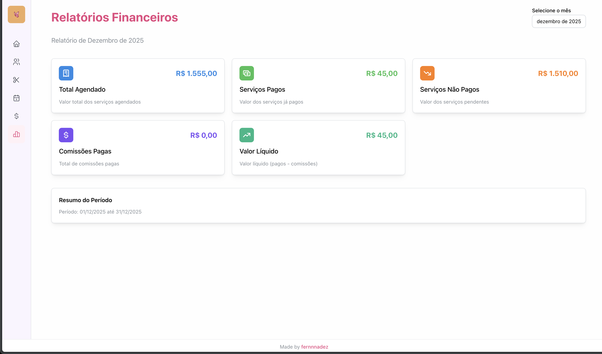
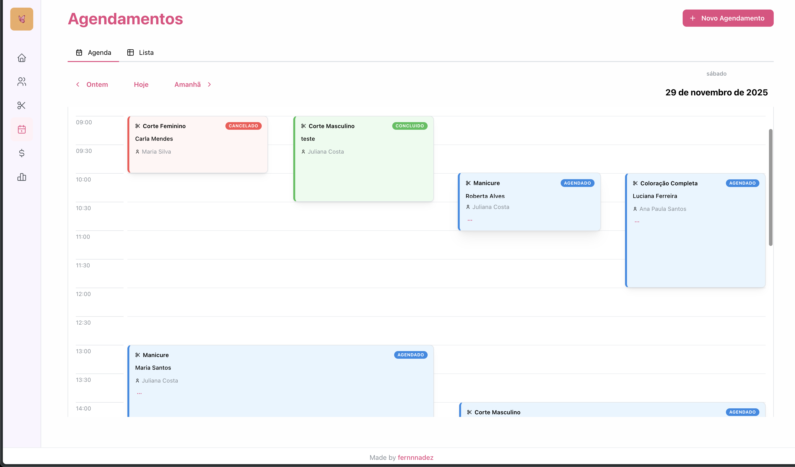
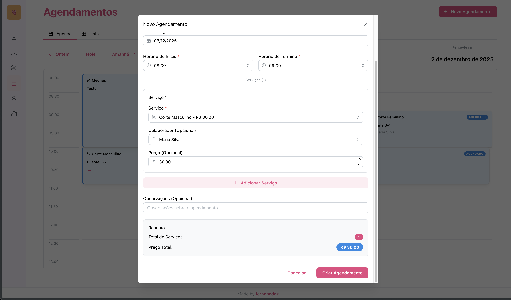

# 💅 Beauty Express

Sistema completo de gestão para salões de beleza, com agendamentos, colaboradores, serviços, comissões automáticas e relatórios financeiros.

## 📋 Sobre o Projeto

- **Gestão de Colaboradores** — cadastro, comissão personalizada, ativação/desativação
- **Catálogo de Serviços** — preços, descrição e associação com colaboradores
- **Agendamentos** — múltiplos serviços, horários, status e registro retroativo
- **Comissões** — cálculo automático ao concluir serviços, controle de pagamento
- **Relatórios Financeiros** — visão mensal de receita, comissões e valor líquido

## 📸 Screenshots

| Dashboard | Agendamentos | Novo Agendamento |
|-----------|--------------|------------------|
|  |  |  |

## 🏗️ Arquitetura

Monorepo com **API REST** e **frontend SPA** independentes:

```
beauty-express/
├── api/                  # NestJS 11 + TypeORM + PostgreSQL
├── frontend/             # React 19 + Vite + Mantine
├── api/docker-compose.yml  # PostgreSQL local
└── docs/
    ├── DEPLOY.md         # Guia de implantação
    └── MULTI_TENANT.md   # Roadmap multi-tenant
```

```
┌──────────────┐     HTTP (CORS)      ┌──────────────┐
│   Frontend   │ ──────────────────►  │     API      │
│  :5173 dev   │                      │   :3000      │
│  Vite/React  │                      │   NestJS     │
└──────────────┘                      └──────┬───────┘
                                           │
                                    ┌──────▼───────┐
                                    │  PostgreSQL  │
                                    │    :5432     │
                                    └──────────────┘
```

### Backend (`api/src`)

```
application/    # Controllers, DTOs
domain/         # Entities, Repositories, Services, Modules
config/         # database.config.ts
scripts/        # seed.ts
```

### Frontend (`frontend/src`)

```
components/     # UI por domínio (appointment, collaborator, service)
pages/          # Dashboard, Colaboradores, Serviços, Agendamentos, etc.
hooks/          # React Query
services/       # Cliente HTTP (Axios)
```

## 🚀 Tecnologias

| Camada | Stack |
|--------|-------|
| **API** | NestJS 11, TypeORM, PostgreSQL, Swagger, Jest |
| **Frontend** | React 19, Vite 7, Mantine 8, TanStack Query, Luxon, dayjs |
| **Infra** | Docker Compose (Postgres), PM2, Nginx (produção) |

## 🛠️ Instalação e Desenvolvimento

### Pré-requisitos

- Node.js 20+
- npm
- Docker (para PostgreSQL local)

### 1. Banco de dados

```bash
cd api
npm run db:up
```

Isso sobe o PostgreSQL via `api/docker-compose.yml`.

### 2. API

```bash
cd api
npm install
cp .env.example .env
npm run start:dev
```

Opcional — popular com dados de exemplo:

```bash
npm run seed
```

- API: `http://localhost:3000`
- Swagger: `http://localhost:3000/docs`

### 3. Frontend

```bash
cd frontend
npm install
cp .env.example .env
npm run dev
```

- App: `http://localhost:5173`
- Conecta à API em `http://localhost:3000` (variável `VITE_API_URL`)

> A API precisa estar rodando antes do frontend.

### Variáveis de ambiente

**`api/.env`** (veja `.env.example`):

```env
PORT=3000
CORS_ORIGIN=http://localhost:5173
DB_HOST=localhost
DB_PORT=5432
DB_USERNAME=postgres
DB_PASSWORD=postgres
DB_DATABASE=beauty_express
DB_SYNCHRONIZE=true
```

**`frontend/.env`**:

```env
VITE_API_URL=http://localhost:3000
```

## 📦 Funcionalidades

### Agendamentos
- Criação com múltiplos serviços e preços customizados
- **Registro retroativo** — datas passadas exigem serviço + colaborador e concluem automaticamente (gera comissões)
- Conclusão, cancelamento e filtro por data

### Comissões
- Cálculo automático por percentual do colaborador
- Filtros por período, colaborador e status de pagamento
- Marcação em lote como paga/não paga

### Relatórios
- Relatório mensal com totais de receita, comissões e valor líquido

## 🧪 Testes

```bash
cd api
npm test              # 164 testes
npm run test:cov      # Com cobertura
```

## 📚 API

Documentação interativa: `http://localhost:3000/docs`

### Endpoints principais

| Recurso | Exemplos |
|---------|----------|
| Colaboradores | `GET/POST /collaborators` |
| Serviços | `GET/POST /services` |
| Agendamentos | `GET/POST /appointments`, `PUT /appointments/:id/complete` |
| Serviços agendados | `POST /scheduled-services/appointment/:id` |
| Comissões | `GET /commissions`, `PUT /commissions/mark-as-paid` |
| Relatórios | `GET /financial-reports/monthly?year=2026&month=6` |

## 🗄️ Banco de Dados

**PostgreSQL 16** com entidades:

- `Collaborator`, `Service`, `Appointment`, `ScheduledService`, `Commission`

Em desenvolvimento, `DB_SYNCHRONIZE=true` cria/atualiza o schema automaticamente. Em produção, use `DB_SYNCHRONIZE=false`.

## 🚀 Implantação

API e frontend são implantados **separadamente**:

- **API** — PM2 + PostgreSQL gerenciado (Railway, Render, RDS, etc.)
- **Frontend** — build estático servido por Nginx, Vercel, Netlify ou CDN

Guia completo: **[docs/DEPLOY.md](./docs/DEPLOY.md)**

## 🔮 Roadmap

Planejamento de **multi-tenant** e **white label** documentado em **[docs/MULTI_TENANT.md](./docs/MULTI_TENANT.md)**.

## 📝 Licença

Projeto privado de uso interno.

---

**Beauty Express** — Gestão completa para seu salão de beleza 💅✨
