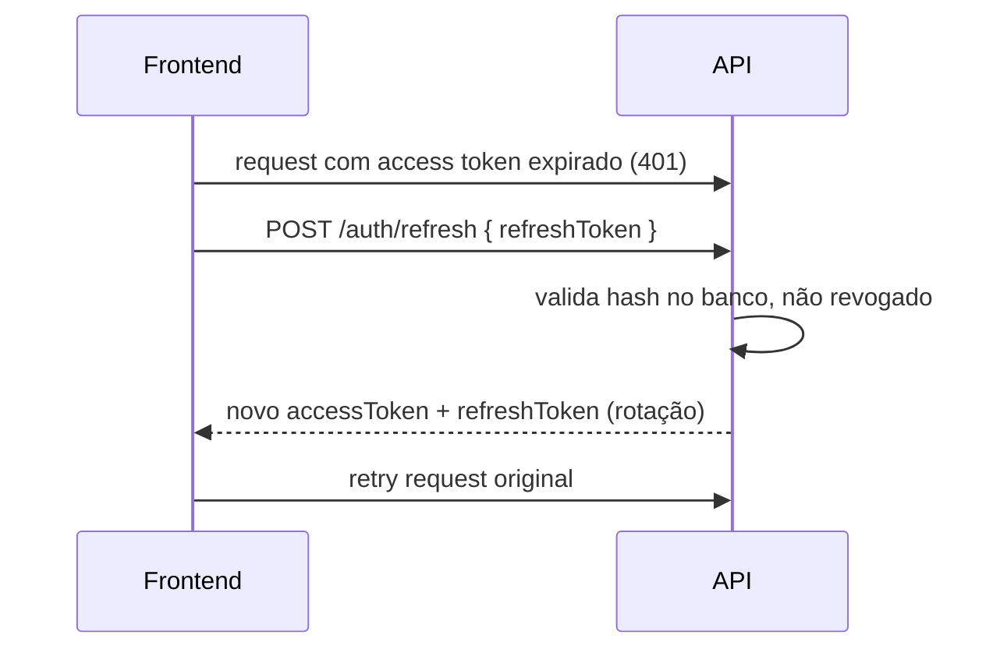

# Plano de Implementação — Auth, Multi-Tenant e Backoffice

> **Branch:** `feat/auth-multi-tenant`  
> **Marca:** Maria Borboleta (esmalterias)  
> **Status:** requisitos validados — pronto para implementação

---

## 1. Requisitos confirmados

| Decisão | Escolha |
|---------|---------|
| Usuário por filial | **1 usuário = 1 filial** (sem acesso multi-unidade) |
| Unidades iniciais | **Paulista**, **Recife**, **Boa Viagem** |
| Criação de usuários (agora) | **Direto no banco** (seed / SQL manual) |
| Sessão | **Access token curto + refresh token** |
| Super acesso | **Você** como `super_admin` com **backoffice exclusivo** |
| Backoffice | Ver tudo, gerenciar filiais e usuários, criar usuários |

---

## 2. Visão geral do sistema

Dois produtos na mesma plataforma:

```
┌─────────────────────────────────────────────────────────────────────┐
│                     Beauty Express Platform                          │
├──────────────────────────────┬──────────────────────────────────────┤
│   APP OPERACIONAL            │   BACKOFFICE (só super_admin)        │
│   app.mariaborboleta.com     │   admin.mariaborboleta.com           │
│                              │                                      │
│   • Agendamentos             │   • Dashboard consolidado            │
│   • Colaboradores            │   • Listar / criar filiais           │
│   • Serviços                 │   • Listar / criar usuários          │
│   • Comissões                │   • Ativar / desativar filial        │
│   • Relatórios da filial     │   • Ver dados de qualquer filial     │
│                              │   • Métricas cross-filial            │
│   Usuários: admin/manager/   │                                      │
│   staff de UMA filial        │   Usuário: você (super_admin)        │
└──────────────────────────────┴──────────────────────────────────────┘
                              │
                    ┌─────────▼─────────┐
                    │   API NestJS      │
                    │   /auth/*         │
                    │   /admin/*  ← só super_admin
                    │   /*        ← filial (tenant-scoped)
                    └─────────┬─────────┘
                              │
                    ┌─────────▼─────────┐
                    │   PostgreSQL      │
                    │   tenantId em     │
                    │   todas as tabelas│
                    └───────────────────┘
```

---

## 3. Modelo de multi-tenant

**Banco único + `tenantId`** em todas as entidades de negócio.

Cada unidade Maria Borboleta é um `Tenant`:

| Slug | Nome exibido | Cidade/contexto |
|------|--------------|-----------------|
| `paulista` | Maria Borboleta — Paulista | São Paulo |
| `recife` | Maria Borboleta — Recife | Recife |
| `boaviagem` | Maria Borboleta — Boa Viagem | Recife (Boa Viagem) |

---

## 4. Modelo de dados

### 4.1 Diagrama

```
┌──────────────┐
│    Tenant    │◄──── tenantId ────┐
│   (filial)   │                   │
└──────────────┘                   │
       ▲                           │
       │ tenantId (nullable)       │ tenantId (obrigatório)
       │                           │
┌──────┴───────┐          ┌────────┴────────┐
│     User     │          │  Collaborator   │
│ super_admin  │          │  Service        │
│ tenantId=null│          │  Appointment    │
└──────────────┘          │  ScheduledSvc   │
                          │  Commission     │
                          └─────────────────┘

┌──────────────────┐
│  RefreshToken    │──► User
│  (hash, expires) │
└──────────────────┘
```

> **Simplificação:** sem tabela `UserTenant`. Como cada usuário pertence a **uma só filial**, `tenantId` fica direto em `User`. Super admin tem `tenantId = null`.

### 4.2 `Tenant`

| Campo | Tipo | Notas |
|-------|------|-------|
| id | uuid | PK |
| name | string | "Maria Borboleta — Paulista" |
| slug | string | único: `paulista`, `recife`, `boaviagem` |
| brandName | string | "Maria Borboleta" |
| isActive | boolean | filial ativa |
| createdAt | timestamptz | |

### 4.3 `User`

| Campo | Tipo | Notas |
|-------|------|-------|
| id | uuid | PK |
| name | string | |
| email | string | único globalmente |
| passwordHash | string | bcrypt |
| role | enum | ver seção 4.4 |
| tenantId | uuid \| null | **null** apenas para `super_admin` |
| isActive | boolean | |
| createdAt | timestamptz | |

### 4.4 Papéis (`UserRole`)

| Role | Onde acessa | Escopo |
|------|-------------|--------|
| `super_admin` | **Backoffice** + API `/admin/*` | Todas as filiais, sem `tenantId` |
| `admin` | App operacional | CRUD completo da sua filial |
| `manager` | App operacional | Operação diária (agendamentos, comissões, relatórios) |
| `staff` | App operacional | Leitura + ações limitadas (fase posterior) |

**Regra:** usuário com `tenantId` **nunca** acessa rotas `/admin/*`.  
**Regra:** `super_admin` **nunca** acessa rotas operacionais (`/appointments`, etc.) sem passar pelo backoffice com filtro explícito.

### 4.5 `RefreshToken`

| Campo | Tipo | Notas |
|-------|------|-------|
| id | uuid | PK |
| userId | uuid | FK |
| tokenHash | string | hash do refresh token (nunca plain) |
| expiresAt | timestamptz | ex: 7 dias |
| revokedAt | timestamptz \| null | logout / rotação |
| createdAt | timestamptz | |

### 4.6 Entidades existentes

Adicionar em todas:

```typescript
@Column()
tenantId: string;
```

---

## 5. Autenticação com refresh token

### 5.1 Tokens

| Token | Duração sugerida | Payload |
|-------|------------------|---------|
| **Access** | 15 minutos | `{ sub, email, role, tenantId }` |
| **Refresh** | 7 dias | opaco (UUID), persistido no banco |

### 5.2 Endpoints — app operacional

| Método | Rota | Descrição |
|--------|------|-----------|
| POST | `/auth/login` | `{ email, password, tenantSlug }` |
| POST | `/auth/refresh` | `{ refreshToken }` → novo par de tokens |
| POST | `/auth/logout` | revoga refresh token |
| GET | `/auth/me` | usuário + filial atual |

**Login operacional:**
1. Busca tenant pelo `slug`
2. Busca user por `email` + `tenantId` + `isActive`
3. Valida senha
4. Rejeita se `role === super_admin` (deve usar login admin)
5. Retorna `accessToken`, `refreshToken`, `user`, `tenant`

### 5.3 Endpoints — backoffice (super_admin)

| Método | Rota | Descrição |
|--------|------|-----------|
| POST | `/auth/admin/login` | `{ email, password }` — só `super_admin` |
| POST | `/auth/admin/refresh` | refresh do backoffice |
| POST | `/auth/admin/logout` | logout |
| GET | `/auth/admin/me` | perfil super admin |

### 5.4 Fluxo refresh



**Rotação de refresh token:** a cada refresh, o token antigo é revogado e um novo é emitido (previne replay).

### 5.5 Armazenamento no frontend

| App | Access token | Refresh token |
|-----|--------------|---------------|
| Operacional | memória ou sessionStorage | httpOnly cookie **ou** localStorage |
| Backoffice | separado do operacional | chaves distintas para não misturar sessões |

Recomendação MVP: `localStorage` com chaves separadas (`be_access`, `be_refresh` vs `be_admin_access`, `be_admin_refresh`).

---

## 6. Backoffice — escopo funcional

### 6.1 Módulos do backoffice

#### Dashboard consolidado
- Total de filiais ativas
- Agendamentos hoje (por filial e total)
- Receita do mês (por filial e total)
- Comissões pendentes (por filial)
- Gráfico comparativo entre unidades

#### Gestão de filiais (`/admin/tenants`)
- `GET /admin/tenants` — listar todas
- `GET /admin/tenants/:id` — detalhe + métricas
- `PATCH /admin/tenants/:id` — ativar/desativar
- `POST /admin/tenants` — criar nova filial (futuro: quando abrir unidade)

#### Gestão de usuários (`/admin/users`)
- `GET /admin/users` — listar todos (filtro por `tenantId`, `role`)
- `GET /admin/users/:id` — detalhe
- `POST /admin/users` — **criar usuário** (nome, email, senha, role, tenantId)
- `PATCH /admin/users/:id` — ativar/desativar, alterar role
- `DELETE /admin/users/:id` — soft delete (isActive = false)

#### Visão de dados por filial (`/admin/tenants/:id/...`)
- `GET /admin/tenants/:id/appointments` — agendamentos da filial
- `GET /admin/tenants/:id/commissions` — comissões da filial
- `GET /admin/tenants/:id/summary` — resumo financeiro

> Super admin **não** usa as rotas operacionais comuns. Tudo passa por `/admin/*` com `tenantId` explícito na URL (validado pelo guard).

### 6.2 Segurança do backoffice

| Camada | Medida |
|--------|--------|
| API | `SuperAdminGuard` em **todas** as rotas `/admin/*` |
| API | `RolesGuard` rejeita qualquer role ≠ `super_admin` |
| Frontend | Rotas `/backoffice/*` com `SuperAdminRoute` |
| Frontend | Layout separado (visual distinto — tema escuro/admin) |
| Deploy | Subdomínio separado `admin.` (recomendado em produção) |
| Extra (opcional) | Allowlist de IP ou 2FA (fase futura) |

### 6.3 Frontend — estrutura

```
frontend/src/
├── app/                    # App operacional (filial)
│   ├── pages/
│   ├── components/
│   └── hooks/
├── backoffice/             # Só super_admin
│   ├── pages/
│   │   ├── Dashboard.tsx
│   │   ├── Tenants.tsx
│   │   ├── TenantDetail.tsx
│   │   ├── Users.tsx
│   │   └── UserCreate.tsx
│   ├── components/
│   │   └── BackofficeLayout.tsx
│   └── hooks/
├── auth/
│   ├── AuthProvider.tsx
│   ├── AdminAuthProvider.tsx
│   ├── LoginPage.tsx
│   └── AdminLoginPage.tsx
└── App.tsx                 # rotas separadas
```

**Rotas:**

| Path | Quem acessa |
|------|-------------|
| `/login` | usuários de filial |
| `/backoffice/login` | super_admin |
| `/*` | filial autenticada |
| `/backoffice/*` | super_admin autenticado |

---

## 7. Guards e contexto (backend)

```
Request
  → JwtAuthGuard          # token válido?
  → RolesGuard            # role permitida?
  → SuperAdminGuard       # /admin/* → só super_admin
  → TenantGuard           # rotas operacionais → tenantId do token
  → TenantContextService  # injeta tenantId para queries
```

**TenantContext para rotas operacionais:**
```typescript
// user.tenantId do JWT → WHERE tenantId = :tenantId em todas as queries
```

**AdminContext para rotas `/admin/tenants/:tenantId/*`:**
```typescript
// tenantId vem do param da URL, validado que tenant existe
// super_admin pode acessar qualquer tenant
```

---

## 8. Seed inicial

### 8.1 Filiais

```typescript
const tenants = [
  { slug: 'paulista',  name: 'Maria Borboleta — Paulista' },
  { slug: 'recife',    name: 'Maria Borboleta — Recife' },
  { slug: 'boaviagem', name: 'Maria Borboleta — Boa Viagem' },
];
```

### 8.2 Usuários (exemplo dev)

| Email | Role | Filial | Senha (dev) |
|-------|------|--------|-------------|
| `voce@beautyexpress.com` | `super_admin` | — | definida no seed |
| `admin@paulista.mb` | `admin` | paulista | definida no seed |
| `admin@recife.mb` | `admin` | recife | definida no seed |
| `admin@boaviagem.mb` | `admin` | boaviagem | definida no seed |

### 8.3 Dados operacionais

O seed atual (colaboradores, agendamentos, etc.) é **replicado por filial** — cada tenant recebe seu próprio conjunto de dados de demonstração.

---

## 9. Variáveis de ambiente

```env
# JWT
JWT_ACCESS_SECRET=...
JWT_REFRESH_SECRET=...
JWT_ACCESS_EXPIRES_IN=15m
JWT_REFRESH_EXPIRES_IN=7d

# Super admin seed (opcional)
SUPER_ADMIN_EMAIL=voce@beautyexpress.com
SUPER_ADMIN_PASSWORD=...   # só dev; em prod: criar manualmente
```

---

## 10. Fases de implementação (revisadas)

### Fase 1 — Auth + entidades base (3 dias)
- [ ] Entidades: `Tenant`, `User`, `RefreshToken`
- [ ] `tenantId` nas entidades de negócio
- [ ] `AuthModule`: login, refresh, logout (operacional + admin)
- [ ] Guards: `JwtAuthGuard`, `RolesGuard`, `SuperAdminGuard`, `TenantGuard`
- [ ] Seed: 3 filiais + super_admin + 1 admin por filial
- [ ] Testes: login, refresh, rejeição cross-role

### Fase 2 — Isolamento tenant nas rotas operacionais (2 dias)
- [ ] `TenantContextService` (request-scoped)
- [ ] Repositories/services filtram por `tenantId`
- [ ] Guard global nas rotas existentes
- [ ] Seed operacional por filial
- [ ] Testes: filial A não vê dados da filial B

### Fase 3 — API do backoffice (2 dias)
- [ ] `AdminModule` com controllers `/admin/*`
- [ ] CRUD tenants (listar, ativar/desativar)
- [ ] CRUD users (listar, criar, ativar/desativar)
- [ ] Endpoints de visão por filial (appointments, commissions, summary)
- [ ] Dashboard consolidado (métricas agregadas)
- [ ] Testes: não-super_admin recebe 403

### Fase 4 — Frontend operacional (2 dias)
- [ ] Login com slug da filial
- [ ] AuthProvider + refresh automático no Axios
- [ ] Rotas protegidas
- [ ] Layout com nome da unidade + logout

### Fase 5 — Frontend backoffice (2–3 dias)
- [ ] `/backoffice/login` separado
- [ ] `AdminAuthProvider` separado
- [ ] Dashboard consolidado
- [ ] Páginas: filiais, usuários, criar usuário
- [ ] Detalhe da filial com dados operacionais
- [ ] Visual admin distinto (tema/cores diferentes)

### Fase 6 — Hardening (1–2 dias)
- [ ] Rate limit em logins
- [ ] Auditoria básica (log de ações admin)
- [ ] Documentação Swagger separada `/admin` vs operacional
- [ ] Deploy: subdomínios `app.` e `admin.`

---

## 11. Ordem de commits sugerida

```
1. feat(auth): tenant, user, refresh-token entities
2. feat(auth): login, refresh, logout (operational + admin)
3. feat(auth): guards and tenant context
4. feat(domain): tenantId on all business entities
5. feat(seed): maria borboleta units and users
6. feat(admin): backoffice API endpoints
7. feat(frontend): operational login and protected routes
8. feat(frontend): backoffice UI
9. test: tenant isolation and admin access control
```

---

## 12. O que fica fora do MVP (futuro)

- Usuário de filial criar outros usuários (só você via backoffice por agora)
- Subdomínio por filial (`paulista.mariaborboleta.com`)
- White label (logo/cores por unidade)
- 2FA no backoffice
- Convite por e-mail
- `staff` role com permissões granulares
- Impersonate (super_admin "entrar como" filial)

---

## 13. Resumo executivo

| Pergunta | Resposta |
|----------|----------|
| Quantos apps? | 2 interfaces: **operacional** (filial) + **backoffice** (você) |
| Quantas filiais? | 3: Paulista, Recife, Boa Viagem |
| Usuário vê outras filiais? | **Não** (exceto você no backoffice) |
| Quem cria usuários? | **Você**, via backoffice (ou banco direto no início) |
| Sessão? | Access 15min + refresh 7d com rotação |
| Seu acesso? | `super_admin` → `/backoffice` + API `/admin/*` |

---

**Próximo passo:** iniciar **Fase 1** — entidades + auth com refresh token.
